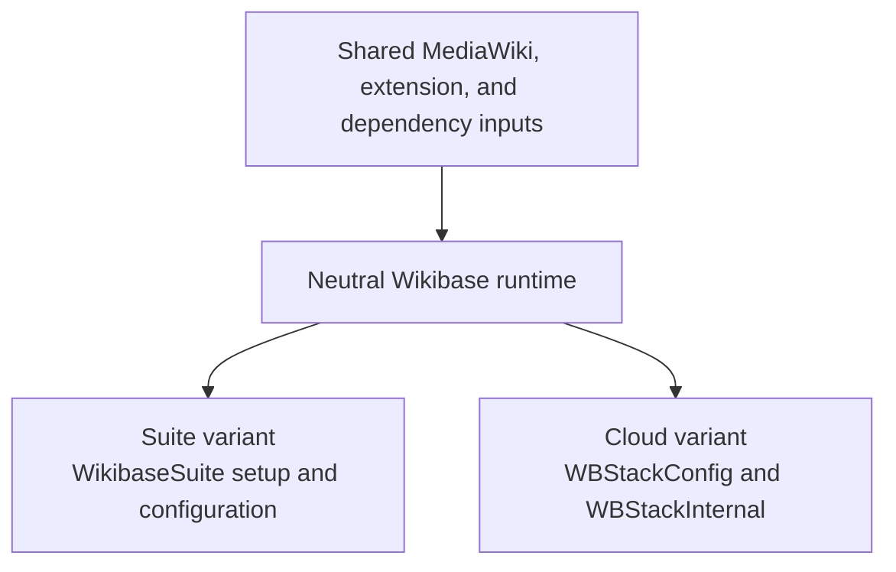

# 25) Shared Wikibase application image for Suite and Cloud {#adr_0025}

Date: 2026-09-18

## Status

Proposed — proof of concept; draft for review.

## Context

Wikibase Suite and Wikibase Cloud run the same application with different
configuration and operational requirements. This POC evaluates a shared
Wikibase image build that produces a neutral runtime and two product variants.
The proposal keeps both products' configuration implementations in the same
maintained image source, with each variant packaging its own configuration.

**This POC targets MediaWiki 1.46.0, the version selected by the Suite image on
this branch. It is not yet a drop-in replacement for Cloud's MediaWiki 1.43
deployment.** A `wikibase-cloud` image based on MediaWiki 1.43, bundling the
unmigrated 1.43-based `wbstack/mediawiki` code, is a possible alternative. This
POC has not attempted that approach, choosing instead to use Suite's existing
MediaWiki 1.46 image base as-is.

The primary question is whether this Dockerfile and runtime structure offer a
practical, efficient way to maintain both products together. WBS development
tooling supplies an existing implementation of dependency updates and builds
with which to evaluate that proposal. So this experiment implicitly presents
Suite's tooling, tests, and release process for review.

The expanded extension bundle and Redis support are separate proposals for
Suite users, already implemented in the intermediate `cloud-ops-parity` branch
on which this POC is based. The full set is being evaluated for inclusion in
Suite regardless of the outcome of this shared-image proposal. For now this
POC assumes full extension parity of what is bundled in both the Suite and
Cloud versions of the image, while keeping the determination of which
extensions are loaded an independent decision for each environment.

### Objectives

- Demonstrate a shared build and dependency set that can produce both Suite
  and Cloud images, reducing duplicated maintenance while preserving their
  different configuration and operating models.
- Keep Suite setup and Cloud's Platform API configuration lifecycle owned by
  their respective image variants. Preserve Cloud's per-request tenant
  selection, tenant-specific maintenance commands, and backend API contract.
- Use the proposed Suite extension bundle and Redis support as the baseline
  for Cloud's requirements, while retaining each product's configuration and
  extension selection independent.
- Demonstrate that Cloud's existing configuration and multi-tenant behaviour
  continues to work with its code adapted for MediaWiki 1.46 compatibility.
  Use the [Cloud Compose and mock Platform API fixture](https://github.com/wmde/wikibase-suite/tree/poc/cloud-wikibase-image/development/images/wikibase/cloud-poc),
  documented in its [README](https://github.com/wmde/wikibase-suite/blob/poc/cloud-wikibase-image/development/images/wikibase/cloud-poc/README.md),
  to exercise two tenants served by one MediaWiki deployment.
- Reuse WBS's declared dependency inputs, update workflow, and build stages.
  Evaluate maintenance effort, build reuse, and image footprint against the
  current Cloud devops for doing the same.
- Present a readable implementation and reproducible evidence that make the
  proposed architecture, compatibility changes, and remaining work reviewable.

## Decision

Evaluate one shared Wikibase build with a neutral runtime and separate Suite
and Cloud targets. Keep Suite as the default build and release target in
support of the direct wikibase-suite use/packaging story.

### Shared build and product variants

The [Dockerfile](../../images/wikibase/Dockerfile) builds MediaWiki and system
dependencies, then installs the declared extension and Composer dependencies.
Both product variants inherit the resulting `wikibase` runtime stage:

The [Bake manifest](../../images/wikibase/docker-bake.hcl) exposes these targets:

| Target | Configuration and purpose |
| --- | --- |
| `wikibase-core` | Neutral runtime for a caller that supplies its own `MW_CONFIG_FILE`. A development building block, with no product release target. |
| `wikibase` | Suite variant and default build. Packages `WikibaseSuite`, selects its settings entry point, and retains Suite's setup, update, and persistent configuration lifecycle. |
| `wikibase-cloud` | Cloud variant. Packages Cloud configuration and internal APIs, adds PHP `pcntl`, and selects `CloudSettings.php` through `MW_CONFIG_FILE`. |

Build-time inputs live in `build/`. Installed files under `runtime/` and
`runtime-cloud/` which mirror precisely the file structure of those resulting
containers. The shared stage copies common runtime files; the product stages copy
their own configuration packages. The Cloud image therefore does not run Suite's
installation or configuration preparation. Both variants use the shared workload
entry point.

### Cloud configuration and initialization

The current Suite wikibase image supports MediaWiki's `MW_CONFIG_FILE` override
before this POC. Selecting an alternative settings entry point bypasses Suite's
configuration preparation and permits purely externally managed configuration.
Cloud's configuration and internal extension code could therefore also be
supplied outside the image, for example as mounted deployment artifacts, if
that better suits Cloud's deployment or software development lifecycle. That
arrangement would still need the required runtime dependencies. This POC
evaluates packaging the Cloud code in the image, while leaving the
`MW_CONFIG_FILE` escape hatch available.

The image packages an initial MediaWiki 1.46 adaptation of the 1.43-based
configuration and internal API code from [`wbstack/mediawiki` revision `220017fe`](https://github.com/wbstack/mediawiki/tree/220017feecaf1332086d0efc4518796916ead509). The [adaptation review](../../images/wikibase/cloud-poc/docs/mw146-adaptation.md)
explains its structural packaging changes, MediaWiki-version adaptations, and
remaining review boundaries. [`CloudSettings.php`](../../images/wikibase/runtime-cloud/opt/wikibase-cloud/CloudSettings.php) loads the tenant
resolver before applying Cloud's MediaWiki settings:

- Web requests select a tenant using `SERVER_NAME`; CLI workloads use
  `WBS_DOMAIN`.
- `WBStackConfig` requests WikiInfo from the Platform API's
  `getWikiForDomain` endpoint. Its APCu cache retains successful lookups for
  ten seconds and failed lookups for two seconds.
- The returned tenant information supplies database identity, site settings,
  service locations, and extension selection. Deployment environment variables
  supply shared service topology, including Redis.
- Cloud's backend deployment enables `WBStackInternal`, which supplies the
  private APIs for initialization, OAuth, search, and site statistics.

The private API role relies on Cloud's deployment access boundary. Marking an
API internal does not itself authorize requests. The local Compose fixture
enables that role for testing and is not a production network layout.

### Dependency updates and build architecture

MediaWiki and image inputs are declared in `docker-bake.hcl`; extension source
pins are in [`build/extensions.json`](../../images/wikibase/build/extensions.json).
The existing [`wbs-dev update` workflow](0020-upstream-updates-and-changelogs.md)
and [image update policy](../../images/wikibase/UPDATING.md) supply the dependency
review process for the shared build. Imported Cloud configuration is currently
repository-owned code, not an automatically refreshed upstream dependency.

Cloud is an additional Bake target, not yet a separately integrated release or
CI product.

## Evidence and evaluation scope

The [Cloud fixture guide](../../images/wikibase/cloud-poc/README.md) describes building the Cloud
target and starting the two-tenant Compose setup. It provisions fresh 1.46
databases, a mock Platform API, Redis, and OpenSearch. The tenant fixtures
select different site identities and enable different optional extensions.

| Evidence | What it establishes and what remains to check |
| --- | --- |
| Dockerfile and Bake targets | Shared build stages and separate packaged configuration paths exist. This is implementation evidence; operation of the Cloud variant still needs validation on the rebased branch. |
| [Compose fixture and bootstrap](../../images/wikibase/cloud-poc/compose.yml) | A reproducible setup for two fresh tenants, with a [mock WikiInfo API](../../images/wikibase/cloud-poc/fake-api/router.php) and tenant-specific schema setup. The existing notes describe a working local fixture; this review has not rerun it or established tenant isolation through automated assertions. |
| [MediaWiki 1.46 adaptation review](../../images/wikibase/cloud-poc/docs/mw146-adaptation.md) | Maps the packaged Cloud code to its upstream source revision and identifies structural packaging, migration, and local changes. The linked semantic diff makes the assessment inspectable. |
| [Existing PR CI run](https://github.com/wmde/wikibase-suite/actions/runs/34637552857) | The pre-rebase branch passed its Suite build and integration checks. That run did not establish Cloud runtime correctness. |
| Cloud configuration and internal API adaptation | The tenant lookup and control-plane interfaces are represented in code. Real Platform API integration, event delivery, jobs, OAuth, and backend authorization still need execution against Cloud dependencies. |

Success for this POC means demonstrating the shared build and both configuration
lifecycles, with representative tenant operations and no regression in the
inherited Suite tests. Packaging every required extension is a separate claim
from exercising every extension feature. The review should identify which
behaviours have executable evidence and which remain proposals.

## Consequences

A shared build would let Suite and Cloud review common dependency changes once
and reuse the application layers while retaining product-owned configuration.
It also couples dependency compatibility: an update suitable for Suite may
require changes to Cloud configuration or APIs before both variants can adopt
it. If a 1.43 adaptation becomes relevant, it could test how much of the
architecture can be shared across different MediaWiki release lines.

The next review should assess whether the maintained Cloud adaptation is small
and understandable enough, how upstream changes will be tracked, and whether
the shared design justifies further work. A working local fixture would support
that decision without committing either product to a combined release schedule
or declaring a production replacement ready.

## Open questions

- The fixture uses fresh databases and a mock Platform API. A real Cloud
  deployment needs validation with its Platform API, tenant data, backend role,
  and deployment environment.
- This POC leaves Cloud's Query Service, Query Service frontend,
  QuickStatements, upload handling, and job workloads in their existing Cloud
  packaging. Their operation alongside the MediaWiki 1.46 Cloud image needs a
  separate compatibility assessment if this direction is pursued.
- A MediaWiki 1.43 `wikibase-cloud` alternative remains available if it becomes
  relevant to the evaluation.
- Should the Suite's image-owned
  [extension profiles](../../images/wikibase/runtime/var/www/html/extensions/WikibaseSuite/config/extension-profiles),
  which group settings for conditional or coordinated extension setup and were
  previously called extension loaders, also be available to Cloud? They are
  currently copied only into the Suite variant; this POC retains Cloud's direct
  `LocalSettings.php` policy.
