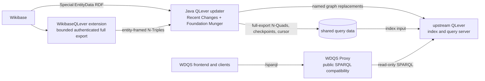

# 26) Evaluate a WDQS-compatible QLever Query Service for Wikibase Suite {#adr_0026}

Date: 2026-09-08

Last reviewed: 2026-09-18

## Status

proposed

## Objectives

- Demonstrate a WDQS-compatible QLever query service for Wikibase Suite,
  including existing frontend workflows, RDF behaviour, labels, and federation.
- Reuse Foundation code and published dependencies where practical, and make
  Suite-specific behaviour and maintenance responsibilities explicit.
- Demonstrate reliable incremental updates and recoverable full indexing at
  the scale of Suite installations.
- Evaluate resource requirements and operational complexity for self-hosted
  and cloud installations.
- Make the code, architecture, documentation, and evidence straightforward for
  other engineers to review and extend.
- Identify what the POC demonstrates, what remains unproven, and how its
  choices relate to Foundation's evolving QLever deployment.

## Context

Wikibase Suite currently packages the Blazegraph-based Wikidata Query Service
(WDQS). QLever is a promising replacement, but it has a different index and
update lifecycle. This ADR records a proof of concept (POC) for evaluating
QLever without treating it as a released replacement for WDQS.

The evaluation is motivated by the total cost of operating a query service:
memory and storage footprint, query behaviour, update reliability, and the
operational complexity that self-hosted and cloud installations must carry.
Earlier Wikimedia work suggests that QLever may provide useful memory and
performance characteristics at large scale. For Wikibase Suite installations,
the hypothesis to test is whether a capable query service can have a practical
starting point below the commonly provisioned 8 GB host class, potentially
toward 4 GB for smaller installations. These are evaluation hypotheses, not
release sizing promises.

Wikimedia's QLever direction uses a Kafka-backed RDF streaming and bulk-index
pipeline. Wikibase Suite does not need to adopt that full architecture merely
to evaluate QLever. The intentional POC divergence is a small, durable updater
that polls MediaWiki Recent Changes, fetches an entity's current RDF snapshot,
and replaces that entity's graph in QLever. This trades Wikidata-scale streaming
throughput for a deployment model suitable for the self-hosted and managed
installations that Wikibase Suite serves.

The inherited WDQS specs are the compatibility baseline. On this branch they
run through the QLever-backed query-service path without changing their
assertions. Additional RDF coverage belongs to this POC; it is not all inherited
from the base branch. QLever must meet the established behaviour. The POC must
not weaken or redefine the baseline merely to make a new backend pass.

## Foundation situation and relationship to this POC

This is a dated assessment of public announcements, architectural proposals,
community discussion, and the source versions used here. A working upstream
prototype establishes technical feasibility, but does not by itself establish
Foundation's deployment policy or a compatibility commitment.

### Deployment and migration

Foundation is already operating QLever-backed WDQS v2 endpoints for pilot
traffic. Its [August 2026 update][foundation-august] reports that WMDE is
porting Query UI to `query-next.wikidata.org` and
`query-scholarly-next.wikidata.org`. This is evidence of continued Query UI
work with QLever, not a requirement to adopt QLever's separate UI.

The [migration status][foundation-migration] still describes a transition
alongside the existing Blazegraph service, targeting migration of all traffic
and Blazegraph decommissioning on **June 30, 2027**. These are targets, not a
completed switch or a guaranteed date. The main/scholarly graph split is
retained. Thus the documented coexistence is old/new services during migration
and separate datasets; it is not a promise of permanent WDQS-v1-compatible and
QLever-native syntax endpoints after retirement. Final legacy-URL routing and
any lasting compatibility endpoint are not established by these sources.

### Query compatibility, proxy, and frontend

The [architecture proposal][foundation-architecture] retains `wdqs-proxy` for
service policy, federation checks, telemetry, and forwarding to the database.
Its request-flow and component sections explicitly exclude automatic
`wikibase:label` rewriting. It is still marked as under review, and an older
risk paragraph on the same page still describes label rewriting. That internal
inconsistency should not be silently resolved by treating either passage as a
final release specification.

The [July community discussion][foundation-label-discussion] supplies useful
context: Jheald raises query readability, existing links, and possible UI-side
compatibility; on July 8, Udehb-WMF describes visible migration tooling rather
than hidden server-side rewriting. On July 15, the response explicitly leaves
WMDE Query UI plans to that team. These are substantive usability concerns and
stated intentions, not a settled promise of a second compatibility endpoint.

The [September newsletter][foundation-september] lists label functionality as
supported in v2 while describing a separate query-rewriting tool planned for
October. Read alongside the [label migration guidance][foundation-label-guide],
this supports migration of the use case; it does not establish that unchanged
`SERVICE wikibase:label` syntax will be accepted by the production endpoint.
The guidance uses ordinary `rdfs:label` patterns, language filters, and fallback
logic. That is a change to query syntax, not evidence that Wikibase labels have
moved to a new RDF predicate: `rdfs:label` is already used by our WDQS-compatible
data. The target is standard SPARQL 1.1, not a wholly different QLever query
language.

### What this branch actually reuses

| Layer | Source used in this POC | Relationship to Foundation's direction |
| --- | --- | --- |
| RDF transformation | Published `org.wikimedia.wdqs:wdqs-common:0.1.0`, tag `v0.1.0`, commit `0366dc8eb12c251787ae141850ab05b136e04dff`; [Munger source][foundation-munger]. | Direct reuse of Foundation's transformation library. Our Java 25 adapter retains blank nodes with `convertBNodesToSkolemIRIs(false)` to preserve the tested WDQS behaviour. Using the library does not make all surrounding updater semantics identical. |
| Public query compatibility | Foundation `wdqs-proxy`, branch `label_service_mark2`, commit `b675070a5dbd828beaa33cd65ab1df5f29e407a1`; [handler registration][foundation-proxy]. | This branch installs automatic label rewriting. Keeping it is a deliberate Suite compatibility choice, beyond the published migration policy above. A small local patch makes query telemetry optional. Continued upstream maintenance of this feature branch is not established. |
| Query engine | Digest-pinned `adfreiburg/qlever` image in the [Suite wrapper](../../images/qlever/docker-bake.hcl). | Reuses QLever itself; this is not Foundation's complete production image or configuration. |
| Updating and full indexing | Suite `RecentChangesUpdater`, `FullExporter`, and the bounded Wikibase export extension. | Replaces the streaming path with polling and whole-entity graph replacement. The [Foundation design][foundation-architecture] uses Kafka-backed streaming producer/consumer updates. This POC does not establish that a smaller deployment of that pipeline would be unsuitable. |
| Query UI | Existing Suite `wdqs-frontend` image, exercised against the proxy. | Preserves the workflows covered by the inherited tests. It does not establish compatibility of every saved query, visualization, or future Foundation frontend release. |

This branch therefore evaluates two intentional choices: a lighter update
mechanism and preservation of selected WDQS-v1 query conveniences. Upstream
code reuse supports both, but does not turn the branch into a miniature copy of
Foundation's planned service. A separate experiment could evaluate more of its
streaming stack and migration policy without changing this branch's reference
tests. Before choosing that path, compare its minimum services, resource cost,
recovery requirements, and the query changes it would ask of Suite users.

## Decision

Evaluate a QLever-backed, WDQS-compatible query-service stack with incremental
updating and a recoverable full-indexing fixture.
Do not declare QLever the released default until the evaluation has sufficient
correctness, operations, and scale evidence.

### POC architecture

The responsibilities are deliberately separate:

- **Wikibase** remains the authoritative entity store. The `WikibaseQLever`
  extension supplies only the Wikibase-side, bounded full-export API, using
  Wikibase's own EntityData RDF serialization.
- **The Java updater** owns synchronization. It uses the Foundation Munger
  directly, the same transformation foundation used by WDQS, then replaces one
  entity-owned named graph at a time. It also produces the N-Quads input and
  checkpoints needed for a full export.
- **QLever** owns indexing, storage, and query execution. The Suite `qlever`
  image is a thin, version-pinned operational wrapper around upstream QLever;
  it does not modify QLever itself.
- **WDQS Proxy** is a separate public-query compatibility boundary. It forwards
  read-only SPARQL to QLever and performs WDQS-specific query rewriting, such
  as `SERVICE wikibase:label`. It has no role in indexing or updates.

Federated `SERVICE` queries are supported through that public path. QLever
enforces `QLEVER_SERVICE_ALLOWED_IRI_PREFIXES`; its default permits
`https://query.wikidata.org/`. The proxy's `QUERY_REWRITER_FEDERATION_ENABLED=false`
disables only its additional allowlist handler, not federation. MWAPI and
path-search rewriting remain outside the POC's supported compatibility scope.

The shared data directory is an operational contract, not a Docker-only API.
An externally operated compatible QLever instance can use the updater when it
shares durable state and full-export data with the process that invokes QLever
indexing. The filesystem must support advisory locking and atomic renames.
The Suite wrapper automates those conventions for the bundled stack.

The diagram's Wikibase-to-updater arrows show returned data: the updater polls
the standard Recent Changes API and fetches individual entities through
`Special:EntityData`; only bulk export uses the extension, which runs inside
Wikibase. Incremental RDF replacements go directly to QLever over HTTP, not
through export files. Shared storage is still used for durable cursors, health
files, locks, and credentials, and for QLever's own index and persisted updates.
For a full rebuild, the updater writes N-Quads to that directory and QLever's
separate indexing process reads them.

### Incremental updates

The POC provides a version-pinned upstream QLever image, a Java updater, and a
proxy-backed public SPARQL endpoint. The updater:

- persists a Recent Changes cursor only after a graph replacement and QLever
  progress marker succeed;
- retries safely after interruption by replaying current entity snapshots;
- detects expired Recent Changes retention rather than silently advancing; and
- pauses while a full export/index cutover is in progress.

The updater uses the published Foundation Munger for RDF shaping in both
incremental updates and full exports. Suite code supplies graph ownership,
update timestamps, and progress metadata around that transformation; reusing
Munger alone does not prove parity for those behaviours.

### Full indexing

The `WikibaseQLever` extension exposes an authenticated, page-ID-cursored,
entity-framed export API. It avoids one HTTP request per entity while retaining
Wikibase's own RDF serialization.

The updater captures a Recent Changes high-water mark before exporting, writes
transformed entity graphs in checkpointed chunks, and assembles an atomic
N-Quads input. QLever performs the actual index operation. After a successful
index, the updater resumes from the high-water mark and replays changes made
during the export. An interrupted export can resume from its checkpoint; an
advisory bootstrap lock prevents concurrent exports while allowing a stale lock
file to be reused by a restarted exporter. A separate update lock waits for
in-flight incremental writes before exporting. The bootstrap marker survives
export completion or failure and is removed only after successful indexing;
the live updater then reloads the saved high-water cursor.

Full indexing is a development/test fixture. Root Compose can initialize an
empty wiki, but does not yet provide a supported migration of a populated wiki.

## Evidence and evaluation scope

Passing tests demonstrate concrete behaviours on their fixture and pinned
versions. They are useful compatibility evidence, not a complete equivalence
proof. Run both suites with `wbs-dev test wdqs qlever`; a green `qlever` run
alone is not a green WDQS baseline run. See the
[test-running guide](../../tests/README.md#run-tests) for setup and options.
Each row below corresponds to a separate spec file; paths are relative to
`development/tests/`.

| Spec file | What it establishes |
| --- | --- |
| [wdqs/wdqs.spec.ts](../../tests/wdqs/wdqs.spec.ts) | Inherited endpoint and frontend workflows, creation/deletion visibility, and their original assertions, run against QLever. The baseline federation assertion only excludes a particular denial message; it does not prove a successful federated result. |
| [wdqs/wdqs-rdf-compatibility.spec.ts](../../tests/wdqs/wdqs-rdf-compatibility.spec.ts) | POC-added assertions for representative qualifiers, references, ranks, unknown values, datavalues, labels, aliases, descriptions, and merge behaviour. These supplement the inherited baseline. |
| [qlever/qlever-proxy.spec.ts](../../tests/qlever/qlever-proxy.spec.ts) | Public endpoint queries, automatic label rewriting, and actual results from an allowlisted local federation target. |
| [qlever/qlever-wdqs-compat.spec.ts](../../tests/qlever/qlever-wdqs-compat.spec.ts) | Selected shared-reference/value-node bindings, Lexeme lemma and label shaping, and redirect/merge results agree with a live Blazegraph reference. This is not a full graph comparison. |
| [qlever/qlever.spec.ts](../../tests/qlever/qlever.spec.ts) | Updater and full-indexing lifecycle: incremental graph replacement, deletion metadata, restart replay, a backlog larger than one response page, temporary dependency outages, rejection of an expired cursor, and interrupted export followed by paused cutover and replay of a post-export edit. |

Local validation on 2026-09-18, with the Java 25 / published Common integration
and cutover fixes in the working tree: the updater image built successfully;
`wbs-dev test qlever --skip-build` passed all 15 tests and
`wbs-dev test wdqs --skip-build` passed all 15 tests. The inherited
`wdqs.spec.ts` is unchanged from `cloud-ops-parity`. Foundation-parent Spotless
and WMF Checkstyle passed, as did ESLint for the changed QLever specs,
`pnpm --dir development typecheck:wbs-dev`, and `git diff --check`. This is a
local validation record, not a claim that the repository's full test suite or
both image architectures were exercised.

The tests do not yet establish every crash boundary, sustained convergence
under concurrent edits and reconciliation, broad query-language compatibility,
or performance under production load. Blank-node identity, shared RDF ownership,
and metadata across all update/rebuild paths remain specific review areas.
The extension's export authentication and resource limits also need dedicated
review before a production rollout.

One observed federation limitation is UTF-8 query text sent to the legacy
Blazegraph reference endpoint: a non-ASCII literal in a federated `BIND` returns
garbled text with this QLever version, even when bypassing our proxy. Direct
Blazegraph POST requests reproduce it with
`Content-Type: application/sparql-query` and return the expected text with
`Content-Type: application/sparql-query; charset=UTF-8`. This demonstrates a
remedy for that individual HTTP request, **not an implemented fix in this POC**.

QLever, not the Suite proxy or updater, sends the federated request. The pinned
image's [Service.cpp, lines 202–210](https://github.com/ad-freiburg/qlever/blob/4ebd303ef75a47033fa394ad70288c87b280cdb8/src/engine/Service.cpp#L202-L210)
passes `application/sparql-query` without a charset to its HTTP client. The
[SPARQL protocol](https://www.w3.org/TR/sparql11-protocol/#query-via-post-direct)
already requires UTF-8 for this request form, so the missing explicit charset
does not itself establish a QLever protocol violation. The evidence points to
legacy endpoint decoding; an explicit charset in QLever would be a candidate
interoperability workaround requiring end-to-end verification. Changing our
incoming proxy headers or updater cannot fix this outgoing request. We have
not patched QLever, added an outbound intermediary, modified the reference
endpoint, or filed an upstream issue.

The positive federation test retrieves a Unicode RDF value using an ASCII
entity IRI; it proves federation and response fidelity, not non-ASCII outbound
query fidelity. The limitation remains open for upstream interoperability
follow-up, without weakening the inherited WDQS assertions or claiming complete
federation compatibility.

Capacity benchmarks and raw monitor captures remain in the team
`qlever-benchmark` workspace. They are evidence for this evaluation, not
release commitments. Before any product decision, the evaluation must record
the dataset, query workload, host shape, QLever configuration, and limitations
behind each reported observation.

## Consequences

This POC adds experimental images, Compose wiring, an internal Wikibase export
extension, and test coverage. It does not add a streaming platform. That is the
scope of this experiment, not a permanent rejection of Foundation's pipeline.

The POC does not yet establish:

- support for a production migration or guided reindex workflow;
- full WDQS feature or performance parity at Wikidata scale;
- a released hardware recommendation; or
- a product decision to retire legacy WDQS. Root Compose selects QLever on
  this experimental branch; the legacy image remains available as a reference.

A later decision to adopt QLever must be supported by demonstrated query
compatibility, recovery and reindex operations, resource measurements at
relevant scales, and an explicit product migration plan.

## References

The dated sources above describe plans and discussion as reviewed on
2026-09-18. Recheck them before presenting the roadmap as current. The source
pins describe the implementation even if upstream branches subsequently move.

[foundation-migration]: https://www.wikidata.org/w/index.php?title=Wikidata:SPARQL_query_service/WDQS_backend_update&oldid=2539496640
[foundation-august]: https://www.wikidata.org/w/index.php?title=Wikidata:Wikidata_Platform_team/Newsletter_August_2026&oldid=2539390869
[foundation-september]: https://www.wikidata.org/w/index.php?title=Wikidata:Wikidata_Platform_team/Newsletter&oldid=2539496928
[foundation-architecture]: https://wikitech.wikimedia.org/w/index.php?title=Wikidata_Query_Service/WDQS_Architecture_re-design&oldid=2447708
[foundation-label-discussion]: https://wikitech.wikimedia.org/w/index.php?title=Talk:Wikidata_Query_Service/Migration/Rewrite_of_Label_Service&oldid=2455170#non-replacement_of_label_service_?
[foundation-label-guide]: https://wikitech.wikimedia.org/w/index.php?title=Wikidata_Query_Service/Migration/Rewrite_of_Label_Service&oldid=2458213
[foundation-munger]: https://gitlab.wikimedia.org/repos/wikidata-platform/wdqs/wdqs-common/-/blob/0366dc8eb12c251787ae141850ab05b136e04dff/src/main/java/org/wikidata/query/rdf/tool/rdf/Munger.java
[foundation-proxy]: https://gitlab.wikimedia.org/repos/wikidata-platform/wdqs/wdqs-proxy/-/blob/b675070a5dbd828beaa33cd65ab1df5f29e407a1/src/main/java/org/wikimedia/wdqs/service/QueryRewriterService.java#L72

- [T291903: Evaluate QLever as a time-lagging SPARQL backend to offload Blazegraph](https://phabricator.wikimedia.org/T291903)
- [T281854: Baseline measurements for splitting scholarly articles from Wikidata](https://phabricator.wikimedia.org/T281854)
- [T359062: Assess Wikidata dump-import hardware](https://phabricator.wikimedia.org/T359062)
- [Wikidata Query Service architecture redesign](https://wikitech.wikimedia.org/wiki/Wikidata_Query_Service/WDQS_Architecture_re-design)
- [MediaWiki EventStreams](https://www.mediawiki.org/wiki/EventStreams)
- [MediaWiki EventBus source documentation](https://github.com/wikimedia/mediawiki-extensions-EventBus)
